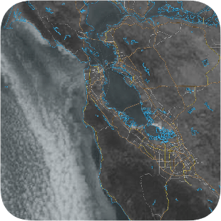
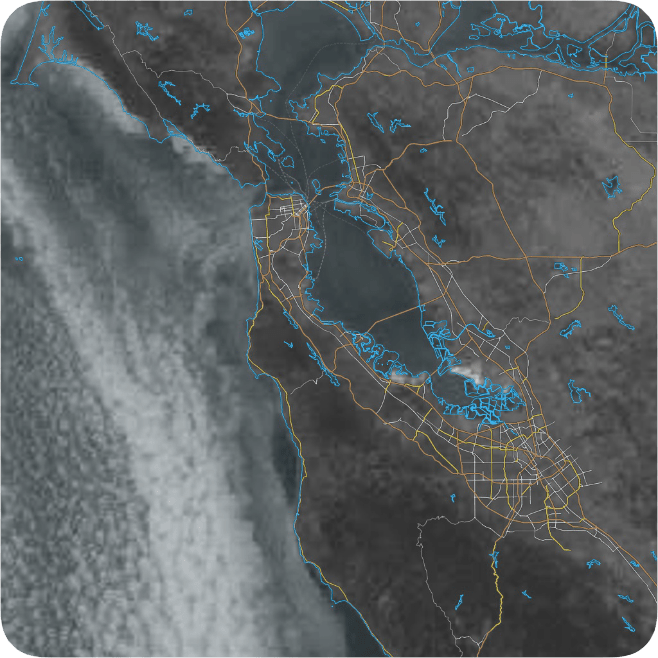
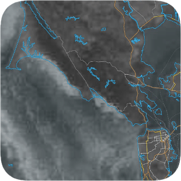

# scriptable-fog-today-widget

> Scriptable iOS widget for Bay Area fog from [Fog Today](https://fog.today)

Fetches the latest Bay Area fog image from Fog Today and displays it in an iOS widget via Scriptable. 

## Usage

Add `script.js` to Scriptable. Add a Scriptable widget and select the script. You can optionally set a widget parameter to a scaling factor that will be used to resize the image. If `2.0` is supplied, the bottom and right halves of the original image will be trimmed. 

### Examples

#### Small

#### Large

#### Scaled

